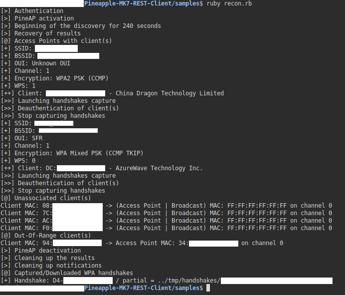

# PINEAPPLE MARK VII REST CLIENT

- The leading rogue access point and WiFi pentest toolkit for close access operations.
- Passive and active attacks analyze vulnerable and misconfigured devices. 
- __@*HAK5*__

> __Author__::      TW-D
>
> __Version__::     1.1.3
>
> __Copyright__::   Copyright (c) 2021 TW-D
>
> __License__::     Distributes under the same terms as Ruby
>
> __Doc__::         https://docs.hak5.org/hc/en-us/articles/360049854174-WiFi-Pineapple-Mark-VII-REST-API
>
> __Requires__::    ruby >= 2.7.0, rest-client 2.1.0 gem, net-ssh 6.1.0 gem and Pineapple Mark VII Firmware <= 1.0.2-stable
>  
>
> __Installation__::
>
> * sudo apt-get install ruby ruby-dev
>
> * sudo gem install rest-client net-ssh

## Usage

See/edit/execute the files in the __*samples/*__ folder



## System Authentication accessors/method
```ruby
system = PineappleMK7::System.new()
```

```
system.host = (string) "172.16.42.1"
system.host()
system.port = (string) "1471"
system.port()
system.mac = (string) "00:13:37:DD:EE:FF"
system.mac()
system.password = (string) "P@55w0rD"
system.login()
```

__host()__, __port()__ and __mac()__ accessors return string

__login()__ method return boolean

## System LED methods
```ruby
system.setup()     # Magenta solid
system.failed()    # Red slow blink
system.attack()    # Yellow single blink
system.special()   # Cyan inverted single blink
system.cleanup()   # White fast blink
system.finish()    # Green very fast blink followed by SOLID
system.off()       # Turns the LED off
```

## Modules

### Module Recon methods
```ruby
recon = PineappleMK7::Modules::Recon
```

```
recon.startScan( (integer) seconds )    # 0 = Continuous
recon.stopScan()
recon.getResults( (integer) scanID )
recon.convertEncryption( (integer) encryption() )
recon.deleteScan( (integer) scanID )
```

__startScan__ method have *scanID()* submethod and return integer

__getResults__ method have *APResults()*, *UnassociatedClientResults()* and *OutOfRangeClientResults()* submethods
> __*APResults()*__ submethod return array of objects where object have :
```
ssid()
bssid()
encryption()    # return bitmask
hidden()
wps()
channel()
signal()
clients() -> client_mac(), ap_mac() and ap_channel()
```
> __*UnassociatedClientResults()*__ submethod return array of objects where object have :
```
client_mac()
ap_mac()
ap_channel()
```
> __*OutOfRangeClientResults()*__ submethod return array of objects where object have :
```
client_mac()
ap_mac()
ap_channel()
```

### Module PineAP methods
```ruby
pineAP = PineappleMK7::Modules::PineAP
```

```

# Clients
pineAP.getClients()

# Deauth
pineAP.deauthAP( (string) bssid, (integer) channel, (array) clients )
pineAP.deauthClient( (string) bssid, (integer) channel, (string) mac )

# Filters
pineAP.filterClient( (string "allow" or "deny") mode )
pineAP.filterSSID( (string "allow" or "deny") mode )

# Handshakes
pineAP.startHandshakesCapture( (hash/object) ap )
pineAP.getHandshakes()
pineAP.stopHandshakesCapture()

# Logging
pineAP.clearActivity()

# Settings
pineAP.enable()
pineAP.setRogue()
pineAP.disable()

# SSIDs
pineAP.addSSID( (string) ssid )
pineAP.clearPool()

```

__getHandshakes()__ method have *handshakes()* submethod return array of objects where object have :
```
type()
bssid()
```

__getClients()__ method return array of objects where object have :
```
mac()
ip()
hostname()
ssid()
tx_bytes()
rx_bytes()
```

### Module Notifications method
```ruby
notifications = PineappleMK7::Modules::Notifications
```

```
notifications.clearAll()
```

### Module Download method
```ruby
download = PineappleMK7::Modules::Download
```

```
download.handshake( (string) bssid, (string) type(), (string) destination )
```

### Module Helpers method
```ruby
helpers = PineappleMK7::Modules::Helpers
```

__lookupOUI( (string) mac )__ method return object with :
```
available()
vendor()
```